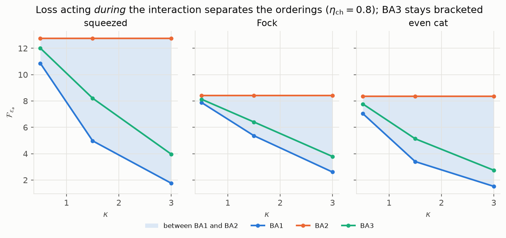
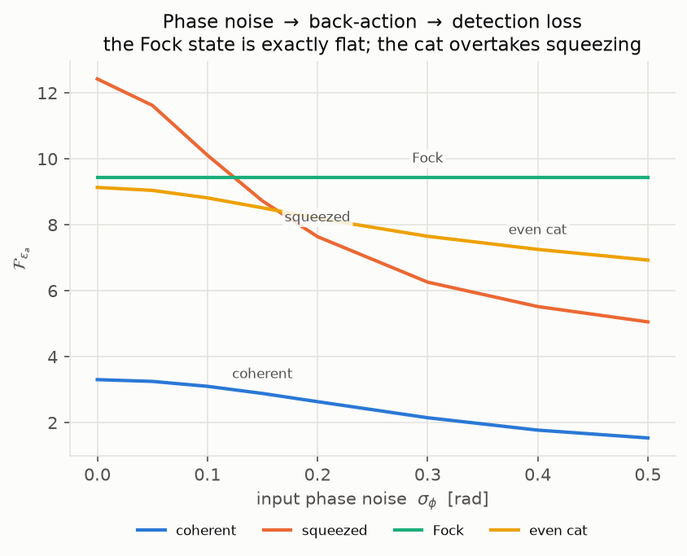
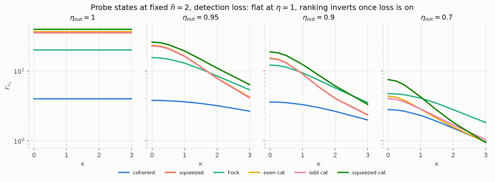

# QFI of optical states under radiation-pressure back-action

```bash
pip install numpy scipy qutip matplotlib pytest
python backaction-qfi/run_study.py      # ~5 min, writes results/*.csv
python backaction-qfi/make_figures.py   # writes results/*.png
pytest backaction-qfi                   # 108 tests, ~25 s
```

The radiation-pressure unitary is added to the existing single-mode
sensing channel rather than reimplemented alongside it: `dynamics.py`,
`sld.py` and `conversions.py` are **copies of the original
`quantum_sensing` modules**, and `get_state_single_mode_ba` extends
`get_state_single_mode` with `kappa` and `ordering` while keeping its signature
and noise staging. With `kappa = 0` it reproduces the original bit for bit.

---

## Scope

| | |
|---|---|
| **Channel** | BA1 (radiation pressure → displacement sensing), BA2 (sensing → radiation pressure), BA3 (simultaneous — the physical case), each with injection loss (loss → BA), concurrent loss (loss *during* BA), detection loss (BA → loss) and phase noise (phase noise → BA → loss) |
| **States** | coherent, squeezed, even/odd cat, squeezed cat, Fock — all at fixed mean photon number ⟨n⟩ |
| **Reported** | QFI per configuration, and the ⟨n⟩ scaling exponent |

## Contents

| file | what it is |
|---|---|
| `radiation_pressure.py` | **new** — the back-action unitary `U_BA = exp(−i κ x̂²/2)` and `get_state_single_mode_ba` |
| `probe_states.py` | **new** — probe states, each solved to a target ⟨n⟩ by root finding |
| `convergence.py` | **new** — the automated Fock-cutoff convergence check |
| `gaussian_reference.py` | **new** — an independent covariance-matrix implementation of the same channel, exact for Gaussian states, used only to check the Fock code |
| `dynamics.py`, `sld.py`, `conversions.py` | *verbatim copies* of the group's `quantum_sensing` modules — the sensing channel, the SLD/QFI routine, and the unit conversions |
| `run_study.py` | the study runner |
| `make_figures.py`, `plotstyle.py` | the figures |
| `test_backaction.py`, `conftest.py` | 108 tests, runnable with `pytest backaction-qfi` |
| `results/` | CSVs and figures |

The group's own tree at `../quantum-sensing-py/` is **untouched** — byte-identical
to `main`. (Note for whoever maintains it: as shipped it cannot be imported,
because the modules sit directly in the hyphenated `quantum-sensing-py/` while
`__init__.py` uses `from quantum_sensing.X import Y` and `pyproject.toml`
declares `include = ["quantum_sensing*"]`. Moving the `.py` files into a
`quantum_sensing/` subdirectory fixes it. That is not done here, to keep the
group's copy unmodified.)

## Method

Radiation pressure at one sideband frequency is the linearised free-mass
input–output relation with the propagation phase dropped. Writing
`x = (a+a†)/√2`, `p = (a−a†)/(i√2)`:

```
x → x,      p → p − κ x + signal
```

so back-action is a **shear** in phase space, generated by

```
U_BA(κ) = exp(−i κ x̂² / 2)
```

equivalently a squeeze plus rotation with `e^r − e^-r = κ`.

The sensing Hamiltonian is
`H = Δ n̂ + ε_a(a†+a) + i ε_p(a†−a)`. Since `(a†+a) = √2 x̂`, **`ε_a` is the
gravitational-wave signal quadrature** and is the estimated parameter
throughout. `ε_p` drives `√2 p̂` and is used only as a deliberately
non-commuting reference. Convert to the dimensionless displacement `λ` with
`F_λ = F_{ε_a} / 2`.

Concurrent loss and dephasing have no single closed-form map, so they are
evolved by Strang splitting with one Richardson step — the splitting error is
cleanly `O(1/n²)` (measured: the error falls by exactly 4.00 per doubling of
`n`), which the extrapolation turns into `O(1/n⁴)`. That agrees with `mesolve`
to 1e-6 across 36 state/config/ordering comparisons and is what makes the case
affordable at all: the integrator costs 4.5 s at `N_basis = 160` and scales as
an N²-dimensional Liouvillian. `sigma_a`/`sigma_p` still use the integrator.

Loss uses the group's own `loss_to_kappa`; phase noise uses `phirms_to_chi`.
Both are applied as closed-form maps by default (`solver="exact"`), which agree
with the `mesolve` integrator to 1e-10 — `solver="mesolve"` still runs the
integrator unchanged. The closed forms are needed because `mesolve`
propagates an N²-dimensional Liouvillian, which cannot reach the cutoffs the
shear demands.

**Every number below went through the cutoff convergence check.** This matters
more than it sounds: at the default `N_basis = 20`, the QFI is wrong by
**202 %** for an even cat at ⟨n⟩ = 4 (κ = 1.5, η = 0.9), and by 95 % for
squeezed vacuum. The `converged` column in every CSV flags the four points
(of 491) that did not converge; see Caveats.

---

## Results

### 1. BA1, BA2 and BA3 coincide — they do not merely bound each other


`results/orderings.csv`, ⟨n⟩ = 2, `eta_out = 0.9`.

| state | κ | no BA | BA1 | BA2 | BA3 | max\|BAᵢ − BA3\| |
|---|---|---|---|---|---|---|
| squeezed | 1.5 | 18.856 | 8.708 | 8.708 | 8.708 | 3.3e−11 |
| Fock | 3.0 | 12.182 | 3.527 | 3.527 | 3.527 | 1.2e−11 |

Agreement is at solver noise, and it is exact rather than accidental: `ε_a`
drives `√2 x̂` while back-action is generated by `x̂²`, and `[x̂², x̂] = 0`. The
whole output density matrix is identical across the three orderings, not just
the QFI (max `|ρᵢ − ρⱼ|` ≈ 4e−16). It survives `eta_in`/`eta_out` and
`pn_in`/`pn_out` because those act strictly before or after the interaction.

**It does not survive dissipation acting *during* the interaction** — see
§2b, where the orderings separate by up to 6× and BA3 is bracketed by BA1
and BA2, which is the behaviour the project plan describes.

**The bounding picture belongs to the non-commuting case.** Estimating `ε_p`
instead separates the orderings by 48×, and BA3 is then bracketed:

| state | BA1 | BA2 | BA3 | bracketed? |
|---|---|---|---|---|
| squeezed | 19.560 | 0.402 | 5.083 | yes |
| even cat | 14.719 | 3.221 | 5.626 | yes |

*Practical consequence:* with stage-separated loss, running all three orderings
is redundant — one suffices. With concurrent loss it is not.

### 2. Injection loss vs detection loss


`results/loss_placement.csv`, η = 0.8, κ = 0 → 3.

| state | injection (loss → BA) | concurrent (loss *during* BA) | detection (BA → loss) |
|---|---|---|---|
| squeezed | 14.244 → **14.244** (flat) | 12.754 → 3.967 (÷3.2) | 11.395 → 1.571 (÷7.3) |
| even cat | 9.318 → **9.318** (flat) | 8.343 → 2.746 (÷3.0) | 7.455 → 1.360 (÷5.5) |
| Fock | 9.404 → **9.404** (flat) | 8.420 → 3.789 (÷2.2) | 7.524 → 2.330 (÷3.2) |
| coherent | 4.000 → **4.000** (flat) | 3.581 → 2.330 (÷1.5) | 3.200 → 1.311 (÷2.4) |

Concurrent loss lands **between** the two extremes for every state — as it
should, since loss spread through the interaction is partly "before" and partly
"after" the shear. It is also the realistic model: in an interferometer the two
processes are not separable in time.

Injection loss gives a QFI **exactly independent of κ**: loss degrades the
input, and the shear that follows is a unitary leaving the generator alone
(`U† x̂ U = x̂`), so it cannot change the QFI. Only detection loss couples to
back-action. For vacuum input the closed form is

```
F_{ε_a} = 2 · 2η / (1 + η(1−η) κ²)
```

— maximal damage at 50 % loss, none at η = 0 or 1. This is a unit test.

*Practical consequence:* readout-side loss is qualitatively worse than
injection-side loss under back-action. A single "total loss" figure hides it.

### 2b. Concurrent loss is where BA1 and BA2 really do bound BA3



`results/concurrent_orderings.csv`, ⟨n⟩ = 2, `eta_ch = 0.8`.

| state | κ | BA1 | BA2 | BA3 | spread | BA3 bracketed |
|---|---|---|---|---|---|---|
| squeezed | 0.5 | 10.867 | 12.754 | 12.015 | 1.89 | yes |
| squeezed | 1.5 | 4.976 | 12.754 | 8.209 | 7.78 | yes |
| squeezed | 3.0 | 1.760 | 12.754 | 3.967 | 10.99 | yes |
| even cat | 3.0 | 1.522 | 8.343 | 2.746 | 6.82 | yes |
| Fock | 3.0 | 2.608 | 8.420 | 3.789 | 5.81 | yes |

**BA3 is bracketed in all 9 cases**, and the bracket is wide — a factor 6 at
κ = 3 for squeezed vacuum. This is the configuration the project plan has in
mind: once loss and radiation pressure overlap in time, where you put the shear
genuinely matters, and the two sequential orderings are the extremes.

Two structural features worth reading off:

* **BA2 is exactly flat in κ** (12.754 at every κ for squeezed vacuum). In BA2
  the whole shear lands *after* the lossy sensing, so it is a QFI-preserving
  unitary applied last — the QFI cannot depend on κ at all. It is the best case,
  and a useful internal check.
* **BA1 is the worst case** — the full shear acts before any of the loss, so
  every bit of the inflated `p` variance is exposed to it. BA3, spreading the
  shear through the interaction, sits in between.

So the ordering question is not academic after all; it was only degenerate
because the earlier runs idealised loss into separate stages.

### 3. Phase noise → back-action → detection loss



`results/phase_noise.csv`, κ = 1, `eta_out = 0.9`.

| σ_φ (rad) | 0.0 | 0.1 | 0.2 | 0.3 | 0.5 |
|---|---|---|---|---|---|
| squeezed | **12.422** | 10.109 | 7.639 | 6.260 | 5.054 |
| Fock | 9.426 | **9.426** | **9.426** | **9.426** | **9.426** |
| even cat | 9.132 | 8.815 | 8.196 | 7.650 | 6.928 |
| coherent | 3.303 | 3.100 | 2.635 | 2.147 | 1.534 |

* **The Fock state is exactly immune.** Its density matrix is diagonal, and
  dephasing multiplies `ρ_mn` by `exp(−σ²(m−n)²/2)`, which is 1 on the
  diagonal. Flat to the last digit — structural, not numerical.
* **The ranking inverts.** Squeezed vacuum loses 59 % of its QFI across this
  range, the cat 24 %. Crossovers: the **Fock state passes squeezed vacuum at
  σ_φ ≈ 0.125 rad**, the **even cat at σ_φ ≈ 0.164 rad**.

### 4. Probe states at fixed ⟨n⟩ = 2



`results/states_vs_kappa.csv`.

**η = 1 — every state is exactly flat in κ.** Radiation pressure on its own
costs nothing: it is unitary and commutes with the signal generator, so it only
bites in combination with loss or phase noise.

| state | κ = 0 | κ = 1 | κ = 3 |
|---|---|---|---|
| coherent | 4.000 | 4.000 | 4.000 |
| Fock | 20.000 | 20.000 | 20.000 |
| even cat | 36.523 | 36.523 | 36.523 |
| squeezed | 39.596 | 39.596 | 39.596 |

**η = 0.7 — the ranking inverts as κ grows:**

| state | κ = 0 | κ = 1.0 | κ = 1.5 | κ = 3.0 |
|---|---|---|---|---|
| squeezed | **7.553** | **4.254** | 2.751 | 0.946 |
| Fock | 4.744 | 4.100 | **3.446** | **1.828** |
| even cat | 4.368 | 2.850 | 2.096 | 0.956 |
| coherent | 2.800 | 2.314 | 1.902 | 0.969 |

The Fock state starts 1.6× *behind* squeezed vacuum and ends 1.9× *ahead*,
**crossing at κ ≈ 1.09**. Nothing about the Fock state is special except its
small `Var(x)` — what is rewarded is compactness along the quadrature that
drives the back-action.

### 5. ⟨n⟩ scaling


`results/nbar_scaling.csv`, `results/nbar_scaling_fits.csv`. `α_local` is the
log–log slope between the top two grid points (⟨n⟩ = 4 and 6); α = 1 is
shot-noise-like for this displacement QFI.

| config | coherent | squeezed | Fock | even cat |
|---|---|---|---|---|
| no BA, lossless | 0.000 | 0.911 | 0.907 | 0.950 |
| BA κ=1, lossless | 0.000 | 0.911 | 0.907 | 0.950 |
| BA κ=1, η=0.9 | 0.000 | 0.156 | 0.362 | **−0.811** |
| BA κ=2, η=0.9 | 0.000 | 0.067 | 0.459 | **−0.249** |

This is the sharpest result. Lossless, every non-classical state scales with
α → 1 (the displacement QFI grows like 8⟨n⟩), and back-action changes nothing.
Add detection loss and the scaling **collapses**:

* **squeezed vacuum saturates** — 12.42 → 14.43 → 15.37 over ⟨n⟩ = 2 → 4 → 6.
  Extra photons buy almost nothing.
* **cats turn over** — the even cat peaks near ⟨n⟩ ≈ 2 (9.13) then *falls* to
  6.49 at ⟨n⟩ = 4 and 4.67 at ⟨n⟩ = 6. **Adding photons to a cat actively hurts
  once back-action and loss are both present.**
* **the Fock state keeps a healthy exponent** (0.36–0.46) and at κ = 2 overtakes
  everything by ⟨n⟩ = 6 (9.30 vs squeezed 6.76).

So "more photons is better" fails under back-action plus loss, and fails worst
for the most non-classical probes. There is an optimal photon number, and for
cats it is small.

---

## Validation

`test_backaction.py` (108 tests, `pytest backaction-qfi`) checks against two
independent references — closed-form Gaussian results, and `gaussian_reference.py`,
a covariance-matrix implementation of the same channel that shares no code with
the Fock track and is exact for Gaussian states:

* `U_BA† x̂ U_BA = x̂` and `U_BA† p̂ U_BA = p̂ − κ x̂`, and the shear's
  squeeze–rotation decomposition with `e^r − e^-r = κ`;
* `kappa = 0` reproduces `get_state_single_mode` exactly;
* `solver="exact"` and `solver="mesolve"` agree to 1e-10;
* the closed-form vacuum result `2·2η/(1+η(1−η)κ²)`;
* injection loss κ-independent, detection loss monotonically decreasing;
* every state hits its target ⟨n⟩ to 1e-6;
* squeezed vacuum is confirmed to be the exact maximiser of `Var(x)` at fixed
  ⟨n⟩ (a Lagrange-multiplier eigenproblem giving
  `F_λ = 2(2n̄+1+2√(n̄(n̄+1)))`), which is why it leads every lossless ranking;
* agreement with `gaussian_reference` across orderings, losses and quadratures.

## Still to do

* **"States optimised without back-action from previous code."** Deliberately
  *not* reported here. Those states come from the group's earlier optimisation
  runs and need the `consolidated_data` directory
  (`quantum_sensing.states.set_data_dir`, then `get_best_qfi_envelope` /
  `reconstruct_state`), which was not available when this was run. The analytic
  optimum is not a substitute: maximising `Var(x)` at fixed ⟨n⟩ provably gives
  squeezed vacuum, so reporting it would just duplicate the `squeezed` row and
  look like an independent result when it is not. `probe_states.py` keeps
  `optimal_no_backaction` as the closed-form reference for when the real states
  arrive, but it is absent from `STATE_FAMILIES` and appears in no scan.

## Caveats

* **Four unconverged points** of 491, all flagged in the `converged` column.
  One is `squeezed` at ⟨n⟩ = 2, κ = 3, `eta_out = 0.95` (capped at
  `N_basis = 700`, last relative change 5.6e−6 — good to ~1e−5, it just missed
  the two-consecutive-rungs criterion). The other three are `squeezed` at κ = 3
  under **concurrent** loss, capped at `N_basis = 340` with last relative
  changes of 1.1e−3 and 4.6e−3, so those three numbers are good to about three
  digits rather than six. The concurrent path carries a lower cutoff cap because
  it costs more per cutoff; raising it is a pure compute question.
* **Convention warning.** `conversions.r_to_var` returns `exp(−r²)`, not
  `exp(−2r)`; its docstring flags it as the optimisation code's convention, but
  it is inconsistent with `n_to_r` in the same module. The states here use the
  textbook `n̄ = sinh²r` matching `n_to_r`, and avoid `r_to_var`.
* The QFI is a bound over all measurements. Nothing here says a homodyne, or any
  realisable readout, attains it.
* This is one sideband frequency at a time. Per-frequency additivity, the
  interferometer calibration `κ(Ω)` and the broadband cost metrics are outside
  this folder, in [`../FINDINGS.md`](../FINDINGS.md).
