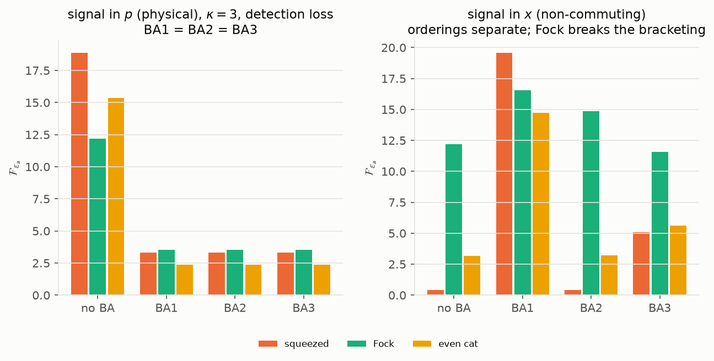
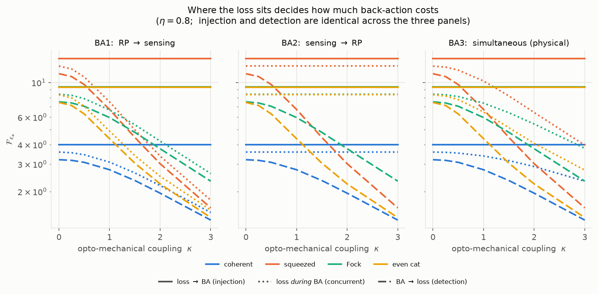
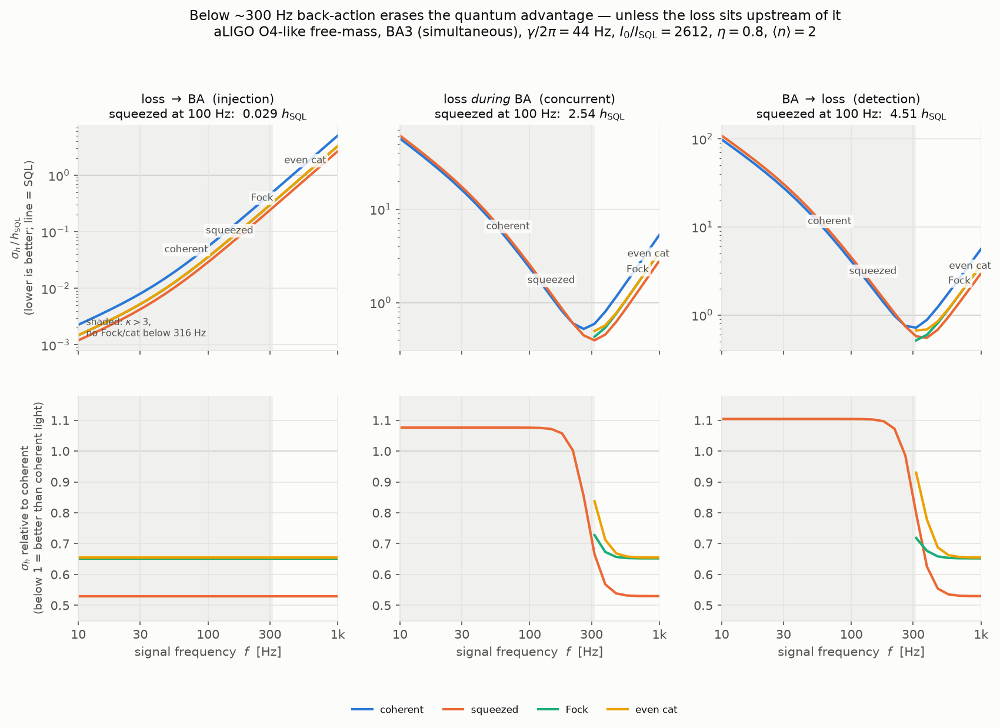
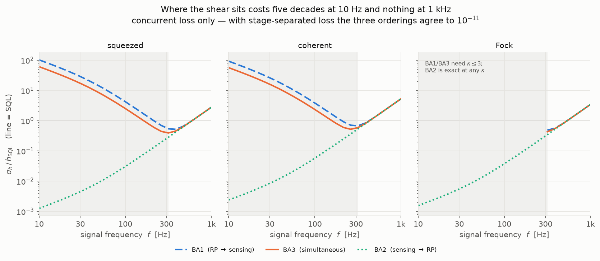
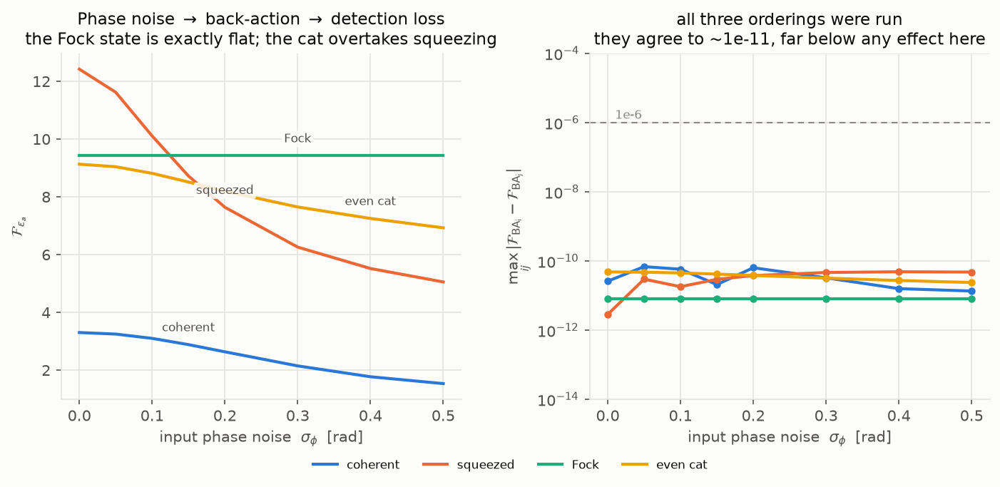
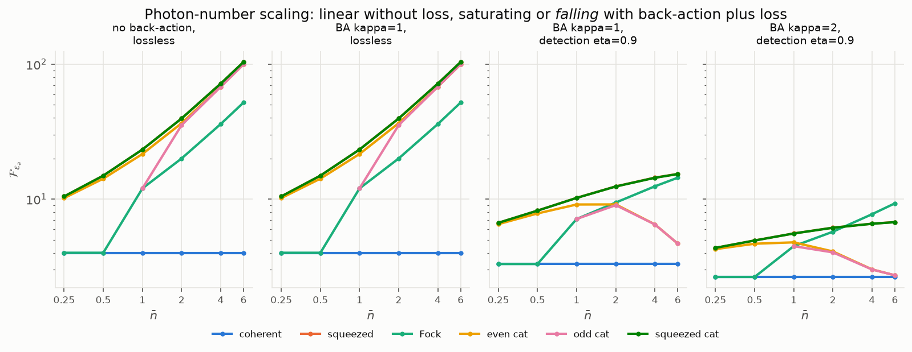

# QFI of optical states under radiation-pressure back-action

```bash
pip install numpy scipy qutip matplotlib pytest
python backaction-qfi/run_study.py      # ~30 min, writes results/*.csv
python backaction-qfi/run_study.py --only B   # ...or just one section
python backaction-qfi/make_figures.py   # writes results/*.png
pytest backaction-qfi                   # 174 tests, ~165 s
```

The radiation-pressure unitary is added to the existing single-mode
sensing channel rather than reimplemented alongside it: `dynamics.py`,
`sld.py` and `conversions.py` are **copies of the original
`quantum_sensing` modules**, and `get_state_single_mode_ba` extends
`get_state_single_mode` with `kappa` and `ordering` while keeping its signature
and noise staging. With `kappa = 0` it reproduces the original bit for bit.

---

## Scope

| | |
|---|---|
| **Channel** | BA1 (radiation pressure → displacement sensing), BA2 (sensing → radiation pressure), BA3 (simultaneous — the physical case), each with injection loss (loss → BA), concurrent loss (loss *during* BA), detection loss (BA → loss) and phase noise (phase noise → BA → loss) |
| **States** | coherent, squeezed, even/odd cat, squeezed cat, Fock — all at fixed mean photon number ⟨n⟩ |
| **Reported** | QFI per configuration, and the ⟨n⟩ scaling exponent |

## Contents

| file | what it is |
|---|---|
| `radiation_pressure.py` | **new** — the back-action unitary `U_BA = exp(−i κ x̂²/2)` and `get_state_single_mode_ba` |
| `probe_states.py` | **new** — probe states, each solved to a target ⟨n⟩ by root finding |
| `convergence.py` | **new** — the automated Fock-cutoff convergence check |
| `gaussian_reference.py` | **new** — an independent covariance-matrix implementation of the same channel, exact for Gaussian states, used only to check the Fock code |
| `ifo.py` | **new here** — κ(Ω), h_SQL(Ω), the strain conversion, the inverse κ → f, and the `ALIGO_O4` preset built from real arm-cavity numbers |
| `dynamics.py`, `sld.py`, `conversions.py` | *verbatim copies* of the group's `quantum_sensing` modules — the sensing channel, the SLD/QFI routine, and the unit conversions |
| `run_study.py` | the study runner |
| `make_figures.py`, `plotstyle.py` | the figures |
| `test_backaction.py`, `conftest.py` | 174 tests, runnable with `pytest backaction-qfi` |
| `results/` | CSVs and figures |


## Method

Radiation pressure at one sideband frequency is the linearised free-mass
input–output relation with the propagation phase dropped. Writing
`x = (a+a†)/√2`, `p = (a−a†)/(i√2)`:

```
x → x,      p → p − κ x + signal
```

so back-action is a **shear** in phase space, generated by

```
U_BA(κ) = exp(−i κ x̂² / 2)
```

equivalently a squeeze plus rotation with `e^r − e^-r = κ`.

The sensing Hamiltonian is
`H = Δ n̂ + ε_a(a†+a) + i ε_p(a†−a)`. Since `(a†+a) = √2 x̂`, **`ε_a` is the
gravitational-wave signal quadrature** and is the estimated parameter
throughout. `ε_p` drives `√2 p̂` and is used only as a deliberately
non-commuting reference. Convert to the dimensionless displacement `λ` with
`F_λ = F_{ε_a} / 2`.

**Concurrent loss and dephasing.** The three pieces of the channel each have an
exact cheap form in the Fock basis on their own — the unitary is a single phase
in the `x̂` eigenbasis, loss is a shifted-diagonal sum, dephasing is an
elementwise multiply. What they cannot do is simply be multiplied together when
they act at the same time: the Lindblad operator `a` does not commute with
`x̂²`, so `e^{A+B} ≠ e^A e^B`.

That is a statement about cost, not about solvability. The exact answer is
`exp(𝓛T)` for the full Liouvillian, and it is used here as a reference at small
cutoffs — it reproduces the split-step result to 8e−9. But `𝓛` is an N²×N²
superoperator and a dense exponential is `O(N⁶)`: 0.1 s at `N_basis = 20`, 27 s
at 60, and ~1.3e10 entries (~200 GB) at the `N_basis ≈ 340` the shear forces.
It does not run out of patience, it runs out of memory.

(For a *Gaussian* probe there is a genuine closed form in elementary functions:
the drift `A = −(γ/2)I + K` is scalar plus nilpotent, so `e^{At} = e^{−γt/2}(I + Kt)`
exactly and the covariance integrals are elementary. That does not help here,
because the probes are cats and Fock states, for which the Fock representation
is forced.)

So the concurrent case is evolved by **Strang splitting with one Richardson
step**, at `O(N³)` per step. The splitting error is cleanly `O(1/n²)`
(measured: the error falls by exactly 4.00 per doubling of `n`), which the
extrapolation turns into `O(1/n⁴)`. That agrees with `mesolve` to 1e-6 across 36
state/config/ordering comparisons. `sigma_a`/`sigma_p` still use the integrator.

Loss uses the group's own `loss_to_kappa`; phase noise uses `phirms_to_chi`.
Both are applied as closed-form maps by default (`solver="exact"`), which agree
with the `mesolve` integrator to 1e-10 — `solver="mesolve"` still runs the
integrator unchanged. The closed forms are needed because `mesolve`
propagates an N²-dimensional Liouvillian, which cannot reach the cutoffs the
shear demands.

**Every number below went through the cutoff convergence check.** This matters
more than it sounds: at the default `N_basis = 20`, the QFI is wrong by
**202 %** for an even cat at ⟨n⟩ = 4 (κ = 1.5, η = 0.9), and by 95 % for
squeezed vacuum. The `converged` column in every CSV flags the five points
(of 1447) that did not converge; see Caveats.

---

## Results

**Which loss model each section uses.** The
orderings collapse onto one number under stage-separated loss and separate under
concurrent loss, so every result below is tagged.

| section | loss model | parameters |
|---|---|---|
| 1. orderings | **stage-separated** | `eta_out` |
| 2. loss placement × ordering | all three | `eta_in` / `eta_ch` / `eta_out` |
| 2b. orderings under concurrent loss | **concurrent** | `eta_ch` |
| 2c. LIGO band, 10 Hz – 1 kHz | all three | `eta_in` / `eta_ch` / `eta_out` |
| 3. phase noise | **stage-separated** | `pn_in`, `eta_out` |
| 4. probe states vs κ | **stage-separated** | `eta_out` |
| 5. ⟨n⟩ scaling | **stage-separated** | `eta_out` |

*Stage-separated* means loss and phase noise act strictly **before**
(`eta_in`, `pn_in`) or **after** (`eta_out`, `pn_out`) the opto-mechanical
interaction. *Concurrent* (`eta_ch`, `pn_ch`) means they act **during** it,
alongside the Hamiltonian — the realistic model for an interferometer, where the
two processes are not separable in time.

### 1. BA1, BA2 and BA3 coincide under stage-separated loss — they do not merely bound each other



`results/orderings.csv`, ⟨n⟩ = 2, **detection loss** `eta_out = 0.9` — i.e.
stage-separated. For the concurrent case see §2b, where this degeneracy lifts.

| state | κ | no BA | BA1 | BA2 | BA3 | max\|BAᵢ − BA3\| |
|---|---|---|---|---|---|---|
| squeezed | 1.5 | 18.856 | 8.708 | 8.708 | 8.708 | 3.3e−11 |
| Fock | 3.0 | 12.182 | 3.527 | 3.527 | 3.527 | 1.2e−11 |

Agreement is at solver noise, and it is exact rather than accidental: `ε_a`
drives `√2 x̂` while back-action is generated by `x̂²`, and `[x̂², x̂] = 0`. The
whole output density matrix is identical across the three orderings, not just
the QFI (max `|ρᵢ − ρⱼ|` ≈ 4e−16). It survives `eta_in`/`eta_out` and
`pn_in`/`pn_out` because those act strictly before or after the interaction.

**It does not survive dissipation acting *during* the interaction** — see
§2 and §2b, where the orderings separate by up to 7× and BA3 is bracketed by
BA1 and BA2 in every case tested, which is the behaviour we expected.

**The bounding picture belongs to the non-commuting case — and it is not
universal.** Estimating `ε_p` (signal in `x̂`) separates the orderings by up to
48×:

| state | no BA | BA1 | BA2 | BA3 | bracketed? |
|---|---|---|---|---|---|
| squeezed | 0.400 | 19.560 | 0.402 | 5.083 | yes |
| even cat | 3.168 | 14.719 | 3.221 | 5.626 | yes |
| **Fock** | **12.182** | **16.545** | **14.873** | **11.551** | **no** |

The Fock row is a counterexample to the assumption that BA1 and BA2 bound the
physical case. Its BA3 sits *below both* sequential orderings, and below the
no-back-action value as well. The shear is a squeeze plus a rotation
(`shear_as_squeeze_rotation`), so applied cleanly before or after the signal it
narrows the probe along a quadrature that happens to favour an `x̂` displacement
— Fock gains from it, 12.182 → 16.545 under BA1. Interleaved with the signal it
does not, and the simultaneous case falls below doing nothing at all. Verified
converged — stable to six digits from `N_basis` 200 to 450, and reproduced at
⟨n⟩ = 1 and ⟨n⟩ = 2.

*So BA1/BA2 bracket BA3 for Gaussian-like probes, not in general.* Where a
bracket is claimed below it is a measured result for those states, not a bound
that can be assumed for a new one.

*Practical consequence:* with stage-separated loss, running all three orderings
is redundant — one suffices. With concurrent loss it is not.

### 2. Injection loss vs detection loss, for every ordering



`results/loss_placement.csv`, η = 0.8, κ = 0 → 3, ⟨n⟩ = 2. **All three
orderings**, 252 convergence-checked points.

**Injection and detection do not depend on the ordering.** Run BA1, BA2 and BA3
separately and they return the same number to 1.3e−11 (injection) and 2.1e−11
(detection) — the same `[x̂², x̂] = 0` degeneracy as §1, now confirmed on a second
axis. So one column each suffices:

| state | injection (loss → BA), any ordering | detection (BA → loss), any ordering |
|---|---|---|
| squeezed | 14.244 → **14.244** (flat) | 11.395 → 1.571 (÷7.3) |
| even cat | 9.318 → **9.318** (flat) | 7.455 → 1.360 (÷5.5) |
| Fock | 9.404 → **9.404** (flat) | 7.524 → 2.330 (÷3.2) |
| coherent | 4.000 → **4.000** (flat) | 3.200 → 1.311 (÷2.4) |

**Concurrent loss is the one column where the ordering matters** — and it spans
almost the whole range between the two stage-separated extremes:

| state | BA1 (RP → sensing) | BA2 (sensing → RP) | BA3 (simultaneous) |
|---|---|---|---|
| squeezed | 12.754 → 1.760 (÷7.2) | 12.754 → **12.754** (flat) | 12.754 → 3.967 (÷3.2) |
| even cat | 8.343 → 1.522 (÷5.5) | 8.343 → **8.343** (flat) | 8.343 → 2.746 (÷3.0) |
| Fock | 8.420 → 2.608 (÷3.2) | 8.420 → **8.420** (flat) | 8.420 → 3.789 (÷2.2) |
| coherent | 3.581 → 1.468 (÷2.4) | 3.581 → **3.581** (flat) | 3.581 → 2.330 (÷1.5) |

**BA2 is exactly flat in κ even under concurrent loss** (max deviation 4.8e−7,
and 3.7e−14 for Fock): the whole shear lands *after* the lossy evolution, where
it is a parameter-independent unitary and cannot touch the QFI. BA1 pays the
full cost — its κ = 3 values sit within 12 % of the pure-detection-loss numbers
above. So the concurrent case interpolates between "shear before all the loss"
(free) and "shear before all the loss and the loss after it" (worst), with BA3
in between.

Concurrent BA3 lands **between** the injection and detection extremes for every
state — as it should, since loss spread through the interaction is partly
"before" and partly "after" the shear. It is also the realistic model: in an
interferometer the two processes are not separable in time.

Injection loss gives a QFI **exactly independent of κ**: loss degrades the
input, and the shear that follows is a unitary leaving the generator alone
(`U† x̂ U = x̂`), so it cannot change the QFI. Only detection loss couples to
back-action. For vacuum input the closed form is

```
F_{ε_a} = 2 · 2η / (1 + η(1−η) κ²)
```

— maximal damage at 50 % loss, none at η = 0 or 1. This is a unit test.

*Practical consequence:* readout-side loss is qualitatively worse than
injection-side loss under back-action. A single "total loss" figure hides it.

### 2c. The LIGO band, 10 Hz – 1 kHz



`results/frequency_sweep.csv`, `ifo.py`. κ is not a free knob in a real
interferometer — the sideband frequency fixes it:

```
κ(Ω) = 2 (I₀/I_SQL) γ⁴ / [Ω²(γ² + Ω²)],     h_SQL(Ω) = √(8ℏ / (m Ω² L²))
```

**Detector: aLIGO as built, free-mass.** 40 kg test masses (reduced mass 10 kg
for the differential arm mode), L = 3994.5 m, λ = 1064 nm, ITM transmissivity
1.48 % → arm-cavity pole γ/2π = 44.2 Hz, 350 kW circulating (representative of
O4; design is 750 kW). That gives I_SQL = 134 W and **I₀/I_SQL = 2612**.
Signal recycling is *not* modelled — this is the Kimble free-mass relation with
aLIGO's numbers in it, right for the order of magnitude of κ but not a
substitute for the full signal-recycled response.

The band stops at 1 kHz because back-action is over by then: κ(1 kHz) = 0.02.
It starts at 10 Hz, where **κ = 97 000**.

**Three exact routes, one figure.** No single method covers this band, so the
`method` column records which one produced each row:

| method | what it covers | why it is exact there |
|---|---|---|
| `gaussian` | coherent, squeezed — **all 25 frequencies** | covariance matrices have no Fock cutoff; the drift is a scalar plus a nilpotent, so even the concurrent-loss integrals are elementary |
| `fock` | cat, Fock — **above 284 Hz** (κ ≤ 3) | the cutoff ladder converges |
| `fock (κ-independent)` | cat, Fock — **whole band**, but only injection loss (any ordering) and BA2 under concurrent loss | the shear is a parameter-independent unitary in those configurations, so the κ = 0 value *is* the answer at κ = 97 000 |

The Gaussian and Fock routes agree to **1.3e−7** wherever both can run — across
all three orderings, κ ∈ {0, 0.7, 1.5} and η_ch ∈ {0.8, 0.5} (unit test). What
is genuinely missing is cat and Fock under detection loss, and under concurrent
loss for BA1/BA3, below 284 Hz. Those rows are **absent, not extrapolated** —
the shaded region of the figure marks them.

**The strain bound.** Since `λ = √κ · h / h_SQL`,

```
F_h = κ F_{ε_a} / (2 h_SQL²)      →      σ_h = h_SQL √(2 / (κ F_{ε_a}))
```

so the bottom row is not a replot of the top: the signal transfer carries
`√(2κ)`, which fights the back-action penalty. A lossless vacuum probe sits at
`σ_h/h_SQL = 1/√(2κ)` — a unit test.

Squeezed vacuum at ⟨n⟩ = 2, η = 0.8, BA3, σ_h in units of h_SQL:

| f | κ | injection | concurrent | detection |
|---|---|---|---|---|
| 10 Hz | 9.7e4 | **0.0012** | 61.2 | 108.8 |
| 32 Hz | 6749 | 0.0046 | 16.1 | 28.7 |
| 100 Hz | 167 | 0.029 | 2.54 | 4.51 |
| 316 Hz | 1.96 | 0.268 | 0.394 | 0.573 |
| 1 kHz | 0.020 | 2.66 | 2.81 | 2.97 |

**1. The back-action wall is the whole story below 300 Hz.** With readout loss,
σ_h reaches 109 h_SQL at 10 Hz — two orders of magnitude *worse* than the SQL.
The QFI itself falls by a factor 6.5e9 from 1 kHz down to 10 Hz. Squeezed
vacuum first gets below the SQL at **261 Hz**; below that no amount of squeezing
helps, because the loss is on the wrong side of the shear.

**2. Loss placement is worth 155× in strain at 100 Hz** (0.029 vs 4.51), and
90 000× at 10 Hz. This is the same result as §2, but the frequency weighting
makes its size visible: at the couplings a real detector runs at, *where* the
loss sits is not a correction, it is the dominant term.

**3. The quantum advantage does not merely shrink below 300 Hz — it reverses.**
The bottom row of the figure divides each state by coherent light at the same
frequency, which is the only way to see the state differences at all (they are a
factor of two, against a 1/f envelope spanning five decades):

| | 10 Hz | 100 Hz | 316 Hz | 1 kHz |
|---|---|---|---|---|
| injection, squeezed | 0.530 | 0.530 | 0.530 | 0.530 |
| detection, squeezed | **1.104** | **1.104** | 0.798 | 0.530 |
| detection, Fock | — | — | 0.718 | 0.652 |
| detection, even cat | — | — | 0.930 | 0.655 |

With the loss upstream of the shear, squeezing keeps its full factor 1.9 (ratio
0.530) at every frequency in the band. With the loss on the readout, squeezed
vacuum is **worse than coherent light** below ~250 Hz — ratio 1.10. Squeezing
buys nothing there; it buys less than nothing. That is the whole content of the
back-action wall stated in terms a noise budget can use.

**4. Ordering separates by five orders of magnitude at 10 Hz.**



Under concurrent loss, squeezed vacuum reads BA1 102.8, BA3 61.2, BA2 0.0013
h_SQL. At 1 kHz the three orderings collapse onto a single value for each
placement (2.657 / 2.808 / 2.971, injection / concurrent / detection) and the
placements themselves agree to 12 % — κ = 0.02, so there is no back-action left
to order or to place. **The ordering and placement questions are low-frequency
questions.** Only concurrent loss is plotted: with stage-separated loss the
three orderings agree to 1e−11 (§1), so the figure would be three copies of one
line.

**5. Back-action alone still costs nothing, even at κ = 10⁵.** The injection
curves fall monotonically to 0.0012 h_SQL at 10 Hz: with the loss ahead of the
shear, growing κ is pure signal gain. Read that as a statement about what is
*fundamental* rather than a design target — the QFI assumes the optimal
measurement, which at these couplings is a strongly frequency-dependent
quadrature (variational readout), and it assumes the readout chain is lossless.
The SQL is a statement about readout loss and back-action correlation, not about
back-action itself.

**What this costs the non-Gaussian programme.** Cat and Fock probes reach only
the top half-decade of the band under detection loss. The Fock cutoff scales
with κ, and κ scales as 1/Ω⁴:

| f | κ | cutoff the rule of thumb asks for |
|---|---|---|
| 500 Hz | 0.32 | 27 |
| 284 Hz | 3.0 | 239 |
| 200 Hz | 11.9 | 3 411 |
| 100 Hz | 167 | 6.7e5 |
| 30 Hz | 7 762 | 1.4e9 |
| 10 Hz | 9.7e4 | 2.3e11 |

Lowering the power moves the accessible band down — κ scales with I₀/I_SQL, so
running at 1 % of O4 power puts κ = 3 near 85 Hz — but that is changing the
detector, not the method. Reaching aLIGO's actual operating point with
non-Gaussian probes needs a representation that does not enumerate Fock states:
the obvious candidate is a Gaussian-superposition form, since cat states are
sums of coherent states and the shear, loss and displacement all map Gaussians
to Gaussians. **That is the main open methodological problem in this folder.**

### 2b. Concurrent loss is where BA1 and BA2 really do bound BA3


`results/concurrent_orderings.csv`, ⟨n⟩ = 2, **concurrent loss** `eta_ch = 0.8`
— loss acting *during* the interaction, in contrast to every other section.

| state | κ | BA1 | BA2 | BA3 | spread | BA3 bracketed |
|---|---|---|---|---|---|---|
| squeezed | 0.5 | 10.867 | 12.754 | 12.015 | 1.89 | yes |
| squeezed | 1.5 | 4.976 | 12.754 | 8.209 | 7.78 | yes |
| squeezed | 3.0 | 1.760 | 12.754 | 3.967 | 10.99 | yes |
| even cat | 3.0 | 1.522 | 8.343 | 2.746 | 6.82 | yes |
| Fock | 3.0 | 2.608 | 8.420 | 3.789 | 5.81 | yes |

**BA3 is bracketed in all 9 cases tested here**, and the bracket is wide — a
factor 6 at κ = 3 for squeezed vacuum. (Bracketing is a measured result, not a
guarantee: §1 shows a Fock probe breaking it in the non-commuting quadrature.) This is the configuration the project plan has in
mind: once loss and radiation pressure overlap in time, where you put the shear
genuinely matters, and the two sequential orderings are the extremes.

Two structural features worth reading off:

* **BA2 is exactly flat in κ** (12.754 at every κ for squeezed vacuum). In BA2
  the whole shear lands *after* the lossy sensing, so it is a QFI-preserving
  unitary applied last — the QFI cannot depend on κ at all. It is the best case,
  and a useful internal check.
* **BA1 is the worst case** — the full shear acts before any of the loss, so
  every bit of the inflated `p` variance is exposed to it. BA3, spreading the
  shear through the interaction, sits in between.

So the ordering question is not academic after all; it was only degenerate
because the earlier runs idealised loss into separate stages.

### 3. Phase noise → back-action → detection loss



`results/phase_noise.csv`, κ = 1, `eta_out = 0.9`, `pn_in` scanned — all
**stage-separated** (input phase noise before the interaction, detection loss
after). **All three orderings are recorded**, and they agree to 8e−12 (Fock)
through 6.9e−11 (coherent), so the table below is ordering-independent; the
figure plots `BA3`.

| σ_φ (rad) | 0.0 | 0.1 | 0.2 | 0.3 | 0.5 |
|---|---|---|---|---|---|
| squeezed | **12.422** | 10.109 | 7.639 | 6.260 | 5.054 |
| Fock | 9.426 | **9.426** | **9.426** | **9.426** | **9.426** |
| even cat | 9.132 | 8.815 | 8.196 | 7.650 | 6.928 |
| coherent | 3.303 | 3.100 | 2.635 | 2.147 | 1.534 |

* **The Fock state is exactly immune.** Its density matrix is diagonal, and
  dephasing multiplies `ρ_mn` by `exp(−σ²(m−n)²/2)`, which is 1 on the
  diagonal. Flat to the last digit — structural, not numerical.
* **The ranking inverts.** Squeezed vacuum loses 59 % of its QFI across this
  range, the cat 24 %. Crossovers: the **Fock state passes squeezed vacuum at
  σ_φ ≈ 0.125 rad**, the **even cat at σ_φ ≈ 0.164 rad**.

### 4. Probe states at fixed ⟨n⟩ = 2


`results/states_vs_kappa.csv`. **Stage-separated detection loss** (`eta_out`),
ordering `BA3` — which under this loss model equals BA1 and BA2, so the ranking
here is ordering-independent. Under concurrent loss it would not be.

**η = 1 — every state is exactly flat in κ.** Radiation pressure on its own
costs nothing: it is unitary and commutes with the signal generator, so it only
bites in combination with loss or phase noise.

| state | κ = 0 | κ = 1 | κ = 3 |
|---|---|---|---|
| coherent | 4.000 | 4.000 | 4.000 |
| Fock | 20.000 | 20.000 | 20.000 |
| even cat | 36.523 | 36.523 | 36.523 |
| squeezed | 39.596 | 39.596 | 39.596 |

**η = 0.7 — the ranking inverts as κ grows:**

| state | κ = 0 | κ = 1.0 | κ = 1.5 | κ = 3.0 |
|---|---|---|---|---|
| squeezed | **7.553** | **4.254** | 2.751 | 0.946 |
| Fock | 4.744 | 4.100 | **3.446** | **1.828** |
| even cat | 4.368 | 2.850 | 2.096 | 0.956 |
| coherent | 2.800 | 2.314 | 1.902 | 0.969 |

The Fock state starts 1.6× *behind* squeezed vacuum and ends 1.9× *ahead*,
**crossing at κ ≈ 1.09**. Nothing about the Fock state is special except its
small `Var(x)` — what is rewarded is compactness along the quadrature that
drives the back-action.

### 5. ⟨n⟩ scaling



`results/nbar_scaling.csv`, `results/nbar_scaling_fits.csv`. **Stage-separated
detection loss** (`eta_out`) throughout, ordering `BA3`. `α_local` is the
log–log slope between the top two grid points (⟨n⟩ = 4 and 6); α = 1 is
shot-noise-like for this displacement QFI.

| config | coherent | squeezed | Fock | even cat |
|---|---|---|---|---|
| no BA, lossless | 0.000 | 0.911 | 0.907 | 0.950 |
| BA κ=1, lossless | 0.000 | 0.911 | 0.907 | 0.950 |
| BA κ=1, η=0.9 | 0.000 | 0.156 | 0.362 | **−0.811** |
| BA κ=2, η=0.9 | 0.000 | 0.067 | 0.459 | **−0.249** |

This is the sharpest result. Lossless, every non-classical state scales with
α → 1 (the displacement QFI grows like 8⟨n⟩), and back-action changes nothing.
Add detection loss and the scaling **collapses**:

* **squeezed vacuum saturates** — 12.42 → 14.43 → 15.37 over ⟨n⟩ = 2 → 4 → 6.
  Extra photons buy almost nothing.
* **cats turn over** — the even cat peaks near ⟨n⟩ ≈ 2 (9.13) then *falls* to
  6.49 at ⟨n⟩ = 4 and 4.67 at ⟨n⟩ = 6. **Adding photons to a cat actively hurts
  once back-action and loss are both present.**
* **the Fock state keeps a healthy exponent** (0.36–0.46) and at κ = 2 overtakes
  everything by ⟨n⟩ = 6 (9.30 vs squeezed 6.76).

So "more photons is better" fails under back-action plus loss, and fails worst
for the most non-classical probes. There is an optimal photon number, and for
cats it is small.

---

## Validation

`test_backaction.py` (108 tests, `pytest backaction-qfi`) checks against two
independent references — closed-form Gaussian results, and `gaussian_reference.py`,
a covariance-matrix implementation of the same channel that shares no code with
the Fock track and is exact for Gaussian states:

* `U_BA† x̂ U_BA = x̂` and `U_BA† p̂ U_BA = p̂ − κ x̂`, and the shear's
  squeeze–rotation decomposition with `e^r − e^-r = κ`;
* `kappa = 0` reproduces `get_state_single_mode` exactly;
* `solver="exact"` and `solver="mesolve"` agree to 1e-10;
* the closed-form vacuum result `2·2η/(1+η(1−η)κ²)`;
* injection loss κ-independent, detection loss monotonically decreasing;
* every state hits its target ⟨n⟩ to 1e-6;
* squeezed vacuum is confirmed to be the exact maximiser of `Var(x)` at fixed
  ⟨n⟩ (a Lagrange-multiplier eigenproblem giving
  `F_λ = 2(2n̄+1+2√(n̄(n̄+1)))`), which is why it leads every lossless ranking;
* agreement with `gaussian_reference` across orderings, losses and quadratures.


## Caveats

* **Five unconverged points** of 1447, all flagged in the `converged` column.
  One is `squeezed` at ⟨n⟩ = 2, κ = 3, `eta_out = 0.95` (capped at
  `N_basis = 700`, last relative change 5.6e−6 — good to ~1e−5, it just missed
  the two-consecutive-rungs criterion). The other four are all the same physical
  point — `squeezed` at κ = 3 under **concurrent** loss, BA1 and BA3, recomputed
  in §2 and §2b — capped at `N_basis = 340` with last relative changes of
  1.1e−3 and 4.6e−3, so those numbers are good to about three digits rather than
  six. §2c has none: it covers large κ with the Gaussian route instead. The concurrent path carries a lower cutoff cap because
  it costs more per cutoff; raising it is a pure compute question.
* **Convention warning.** `conversions.r_to_var` returns `exp(−r²)`, not
  `exp(−2r)`; its docstring flags it as the optimisation code's convention, but
  it is inconsistent with `n_to_r` in the same module. The states here use the
  textbook `n̄ = sinh²r` matching `n_to_r`, and avoid `r_to_var`.
* The QFI is a bound over all measurements. Nothing here says a homodyne, or any
  realisable readout, attains it.
* This is one sideband frequency at a time. Per-frequency additivity, the
  interferometer calibration `κ(Ω)` and the broadband cost metrics are outside
  this folder, in [`../FINDINGS.md`](../FINDINGS.md).
